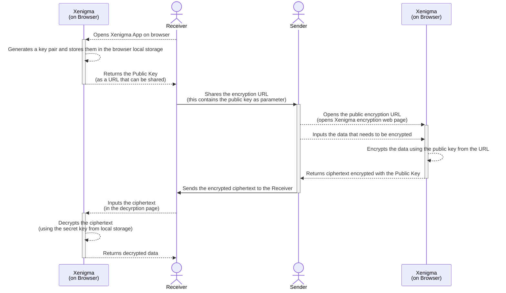

# Xenigma

## What is it?
[Xenigma](https://shibina3.github.io/xenigma) is a web based, fully client-side encryption tool that allows users securely share secrets without having the need to install any software. Xenigma is built on top of [Xipher](https://github.com/shibme/xipher) and is interoperable with it.

### Under the Hood
Xenigma uses the following cryptographic algorithms through xipher web assembly to compress and secure the data:
- [Argon2id](https://en.wikipedia.org/wiki/Argon2) for password hashing.
- [Curve25519](https://en.wikipedia.org/wiki/Curve25519) for elliptic curve cryptography.
- [XChaCha20-Poly1305](https://en.wikipedia.org/wiki/ChaCha20-Poly1305) for symmetric encryption.
- [Zlib](https://en.wikipedia.org/wiki/Zlib) for compression.

## Getting Started
Use [this link](https://shibina3.github.io/xenigma) to access Xenigma the web app.

## How does it work?
The following sequence diagram illustrates the workflow of Xenigma

